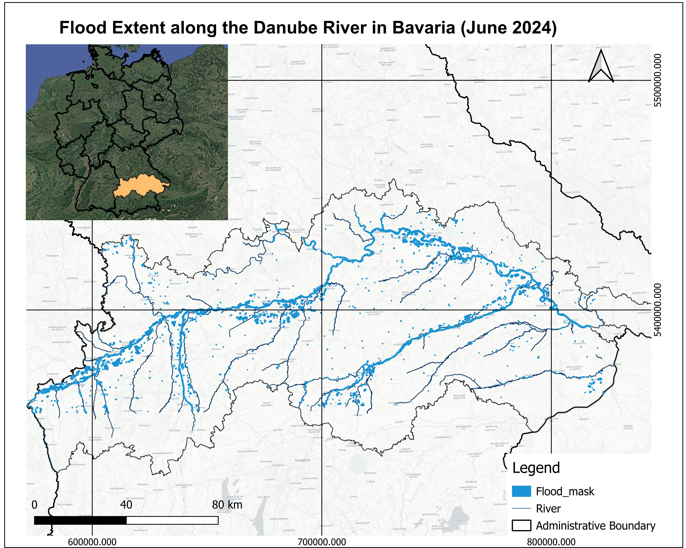

# gee_danube_flood_detection
# Multi-sensor Flood Mapping – Danube River, Bavaria (June 2024)

In June 2024, heavy rainfall caused significant flooding along the Danube River and its tributaries in Bavaria. To map the extent of this event, a flood mapping workflow has been implemented in Google Earth Engine using Sentinel-2 (optical) and Sentinel-1 (SAR) data, leveraging the complementary strengths of both sensors.

---

## Final Flood Extent Map

*Figure: Final fused flood extent along the Danube River in Bavaria, June 2024.*

---

## Results

The pre-flood Sentinel-2 composite established baseline conditions, while the flood-period composite highlighted inundated areas, though partially limited by cloud cover. The optical flood mask effectively delineated open water in cloud-free regions, whereas the SAR flood mask detected inundation in cloud-covered and vegetated areas, filling gaps in the optical data. These outputs were fused to produce the final flood extent, representing the most reliable estimate of inundation as shown in the figure above. Flood statistics were also computed for districts along the Danube and its tributaries to provide an administrative perspective of the impacts.

---

## Conclusion

This project demonstrates a robust and scalable approach to flood mapping using Google Earth Engine. By combining optical and SAR datasets, the workflow produces a reliable representation of flood extent under diverse environmental conditions. The methodology can be applied to other regions for flood monitoring, risk assessment, and disaster response.

Author: Patience Birungi
